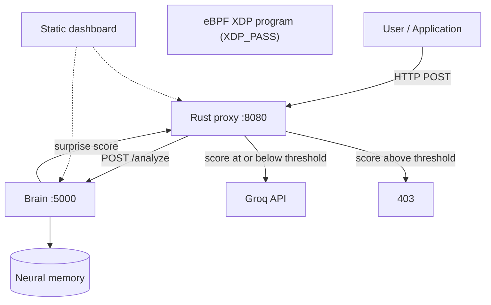

# Project Mnemosyne


**Project Mnemosyne** is a sidecar HTTP proxy for chat-completion traffic. It scores the latest user message with a small neural memory and either forwards the JSON body to the Groq API or returns HTTP 403.

In this repository, **Titans** means that memory module only: the embedding, LSTM, and MLP in `brain/titans.py`, updated with one gradient step at request time. Titans does not name an agent, the proxy, or the eBPF program.

The XDP program in `ebpf_probe/ebpf_program/src/main.rs` returns `XDP_PASS` for every packet. Packet drops are not implemented there. HTTP blocking is the proxy's 403 response.

## What is in the tree

- **Memory service (`brain/`)**: FastAPI on port 5000. Surprise is next-character cross-entropy. `POST /analyze` schedules `update_memory` as a background task. The handler always uses the session id `global_demo_session`. The session id sent by the proxy is logged and is not used to choose a memory.
- **Proxy (`proxy/`)**: Axum on port 8080. `POST /chat/completions` calls the brain, then forwards to `https://api.groq.com/openai/v1/chat/completions` or returns 403. The Groq body is buffered with `resp.text()` and returned whole. The handler does not stream. If the brain cannot be reached or its JSON cannot be parsed, the proxy returns 503.
- **eBPF probe (`ebpf_probe/`)**: An Aya XDP program and a user-space loader. The program passes every packet.
- **Dashboard (`dashboard/index.html`)**: A static page that can call the brain health route, the proxy health route, and `POST /chat/completions`. It does not probe the eBPF loader.
- **`tests/attack_sim.py`**: A script that sends prompts to a running proxy. It is not a unit test. The repository has no CI workflow.

A file-by-file description of what the source shows, and of earlier completion wording that the source does not support, is in [docs/IMPLEMENTATION_NOTES.md](docs/IMPLEMENTATION_NOTES.md).

## Architecture



## Quick start

### Prerequisites

1. Docker, for the brain and proxy images
2. A Linux kernel if you attach the XDP program (native Linux or WSL2)
3. A Groq API key, required by the proxy at startup
4. Python 3.11 or newer, if you serve the dashboard directory or run `tests/attack_sim.py`

### 1. Start the brain and the proxy

```bash
export GROQ_API_KEY=gsk_your_key_here
docker compose up -d
```

`docker-compose.yml` starts those two services. The proxy `depends_on` the brain. The compose file has no `healthcheck`.

### 2. eBPF loader

Optional and separate from the proxy. See [ebpf_probe/README_EBPF.md](ebpf_probe/README_EBPF.md). Attaching the loader does not add packet filtering with the program that is checked in.

### 3. Dashboard

```bash
python -m http.server 3000 --directory dashboard
```

Open http://localhost:3000.

## API

Send a chat-completion JSON body to the proxy:

```bash
curl -X POST http://localhost:8080/chat/completions \
  -H "Content-Type: application/json" \
  -d '{
    "model": "llama3-8b-8192",
    "messages": [
      {"role": "user", "content": "What is the capital of France?"}
    ]
  }'
```

- **200**: the Groq response body, when the brain sets `is_anomaly` to false.
- **403**: the brain set `is_anomaly` to true. The body uses `error` `security_violation` and a `message` that includes the surprise score returned by the brain.
- **503**: the proxy could not obtain a parseable analysis from the brain.

If `model` is omitted, the proxy sets `llama-3.1-8b-instant` before forwarding.

## How the score is computed

`brain/titans.py` maps each character with `ord(c) % 100`, runs the embedding, LSTM, and MLP, and uses cross-entropy against the next character as the surprise score. `is_anomalous` uses a default threshold of `4.2`. `update_memory` takes one Adam step at learning rate `0.01`.

Older descriptions called this module a Titans MAC architecture. The code is the network described above: there is no separate associative-memory update beyond the LSTM state and that single Adam step.

## Repository layout

```
├── brain/              # FastAPI service and neural memory
├── proxy/              # Axum proxy
├── ebpf_probe/         # XDP program and loader
├── dashboard/          # Static HTML page
├── tests/              # attack_sim.py
├── docs/               # Implementation notes
└── docker-compose.yml
```

## Simulation script

```bash
python tests/attack_sim.py
```

The default proxy URL is `http://localhost:8080`. A different URL can be passed as the first argument. The script warms the memory, sends one benign prompt, sends a five-step prompt sequence (it returns when it sees HTTP 403), runs a five-sample latency loop, then sends a two-turn message list and one hyphenated string. In the latency loop, the script prints success when the average of HTTP 200 samples is under 2000 ms. It writes `test_results.json` in the working directory. That output is gitignored. The script needs a running proxy and a Groq key. This repository does not record a result for it.

## License

This repository does not include a license file.
